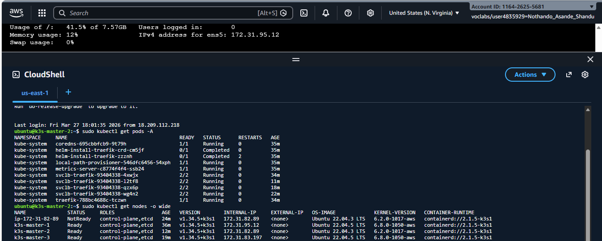
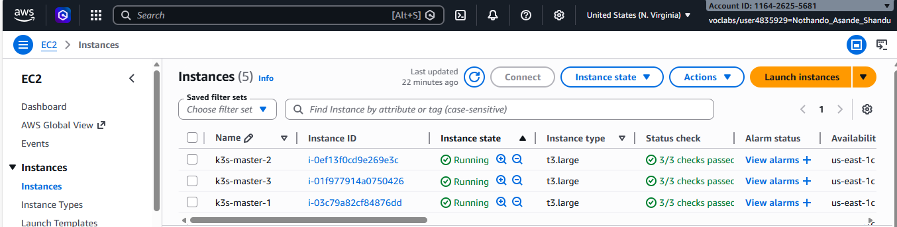
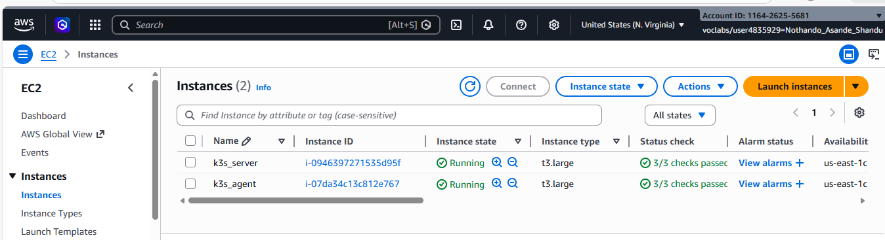
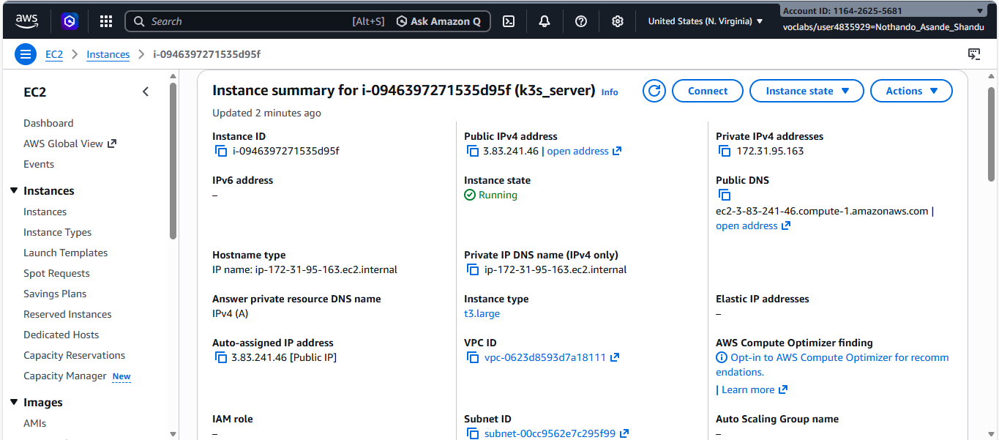
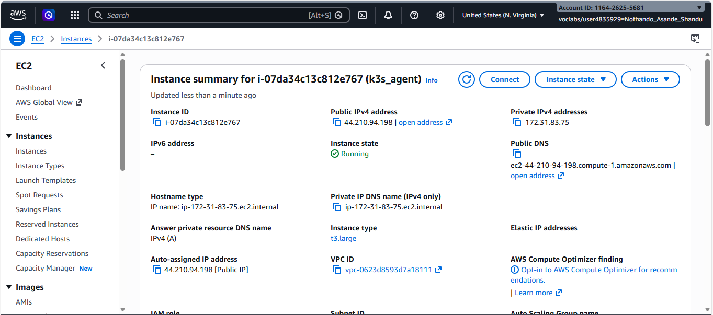
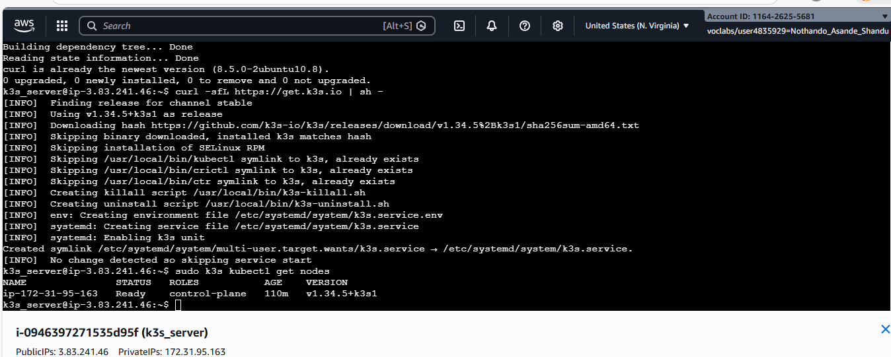
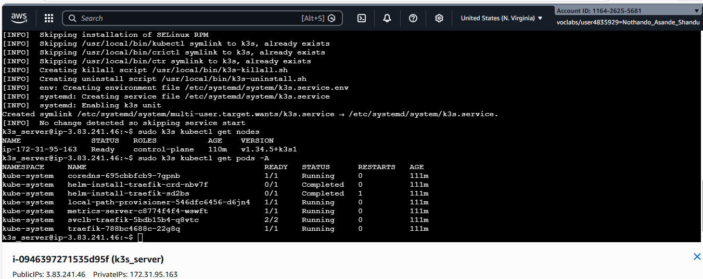
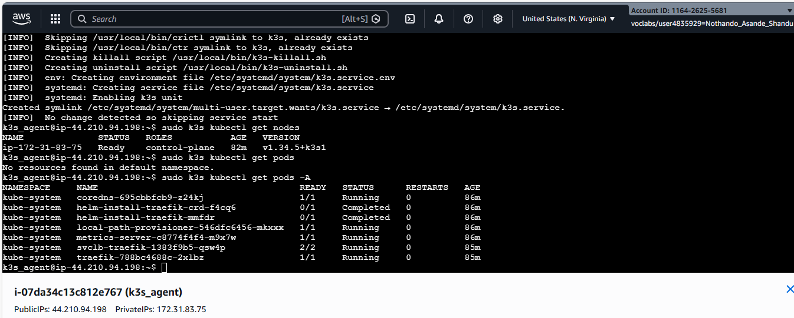
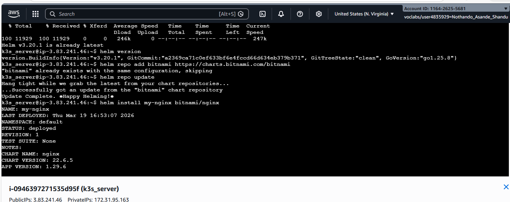
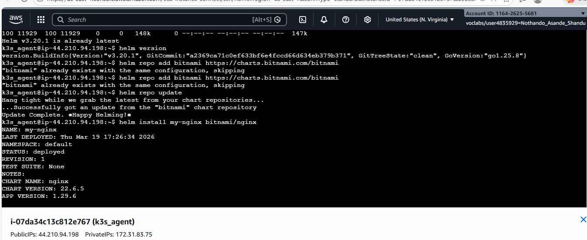

https://github.com/nothando12/assignment-1-Nothando.git

Name: Nothando Shandu

Student Number: 222482958

## Purpose
Deploy a lightweight Kubernetes cluster (k3s) on AWS, document the deployment, demonstrate evidence, and reflect on the work. This develops technical, problem-solving, documentation, and professional skills.


## System Requirements

| Component | Specification |
|-----------|--------------|
| Cloud Provider | AWS EC2 |
| Instance Type | t3.large |
| CPU | 2 vCPUs |
| RAM | 1 GB |
| Storage | 8 GB (EBS Volume) |
| Operating System | Ubuntu 24.04 
| Kubernetes Distribution | K3s |


# Installation Steps — K3s on AWS

These are the steps to deploy a Kubernetes (K3s) cluster on AWS.

## Step 1 — Connect to EC2 Instances
export PS1="k3s_server@ip-3.83.241.46:~$ "

export PS1="k3s_agent@ip-44.210.94.198:~$ "

## Update System Packages on instances
sudo apt update -y

sudo apt upgrade -y

sudo apt install -y curl
 
## Install K3s on the EC2 instances (control plane node):
curl -sfL https://get.k3s.io | sh -

sudo k3s kubectl get nodes

sudo k3s kubectl get pods -A

## successful install or helm deployment
mkdir -p ~/.kube

sudo cp /etc/rancher/k3s/k3s.yaml ~/.kube/config

sudo chown ubuntu:ubuntu ~/.kube/config

export KUBECONFIG=~/.kube/config

curl https://raw.githubusercontent.com/helm/helm/main/scripts/get-helm-3 | bash

helm version

helm repo add bitnami 

https://charts.bitnami.com/bitnami

helm repo update

helm install my-nginx bitnami/nginx

kubectl get deployments
## Prerequisites

- AWS account with permissions to create EC2 instances, VPCs, and security groups
- AWS CLI v2 installed and configured (`aws configure`)
- An EC2 SSH key pair created in the target region
- `kubectl` installed on your local machine

---

## Step 1: AWS Infrastructure Setup

### 1.1 — Variables (set once, reuse throughout)

```sh
export AWS_REGION="us-east-1"
export KEY_NAME="my-k3s-key"        # existing EC2 key pair name
export VPC_ID=$(aws ec2 describe-vpcs \
  --filters "Name=isDefault,Values=true" \
  --query "Vpcs[0].VpcId" --output text \
  --region $AWS_REGION)
export SUBNET_ID=$(aws ec2 describe-subnets \
  --filters "Name=vpc-id,Values=$VPC_ID" \
  --query "Subnets[0].SubnetId" --output text \
  --region $AWS_REGION)
```

### 1.2 — Create a Security Group

```sh
export SG_ID=$(aws ec2 create-security-group \
  --group-name k3s-ha-sg \
  --description "K3s HA cluster security group" \
  --vpc-id $VPC_ID \
  --region $AWS_REGION \
  --query GroupId --output text)

# SSH
aws ec2 authorize-security-group-ingress --group-id $SG_ID \
  --protocol tcp --port 22 --cidr 0.0.0.0/0 --region $AWS_REGION

# Kubernetes API server
aws ec2 authorize-security-group-ingress --group-id $SG_ID \
  --protocol tcp --port 6443 --cidr 0.0.0.0/0 --region $AWS_REGION

# etcd (inter-node only — restrict to the SG itself)
aws ec2 authorize-security-group-ingress --group-id $SG_ID \
  --protocol tcp --port 2379-2380 --source-group $SG_ID --region $AWS_REGION

# Kubelet
aws ec2 authorize-security-group-ingress --group-id $SG_ID \
  --protocol tcp --port 10250 --source-group $SG_ID --region $AWS_REGION

# Flannel VXLAN
aws ec2 authorize-security-group-ingress --group-id $SG_ID \
  --protocol udp --port 8472 --source-group $SG_ID --region $AWS_REGION

# NodePort range (for test applications)
aws ec2 authorize-security-group-ingress --group-id $SG_ID \
  --protocol tcp --port 30000-32767 --cidr 0.0.0.0/0 --region $AWS_REGION

echo "Security group: $SG_ID"
```

### 1.3 — Launch 3 x t3.large Instances

```sh
# Ubuntu 22.04 LTS AMI (update the ami-* ID for your region)
export AMI_ID="ami-0c7217cdde317cfec"   # us-east-1 Ubuntu 22.04 LTS

for i in 1 2 3; do
  aws ec2 run-instances \
    --image-id $AMI_ID \
    --instance-type t3.large \
    --key-name $KEY_NAME \
    --security-group-ids $SG_ID \
    --subnet-id $SUBNET_ID \
    --associate-public-ip-address \
    --tag-specifications "ResourceType=instance,Tags=[{Key=Name,Value=k3s-master-$i}]" \
    --region $AWS_REGION \
    --query "Instances[0].InstanceId" --output text
done
```

> **Note:** Replace `ami-0c7217cdde317cfec` with the latest Ubuntu 22.04 LTS AMI for your region. Find it with:
> ```sh
> aws ec2 describe-images --owners 099720109477 \
>   --filters "Name=name,Values=ubuntu/images/hvm-ssd/ubuntu-jammy-22.04-amd64-server-*" \
>   --query "sort_by(Images,&CreationDate)[-1].ImageId" \
>   --output text --region $AWS_REGION
> ```

### 1.4 — Note the Private and Public IPs

```sh
aws ec2 describe-instances \
  --filters "Name=tag:Name,Values=k3s-master-*" "Name=instance-state-name,Values=running" \
  --query "Reservations[*].Instances[*].[Tags[?Key=='Name']|[0].Value,PrivateIpAddress,PublicIpAddress]" \
  --output table --region $AWS_REGION
```

Record the values — you will need them throughout this guide:

| Hostname | Private IP | Public IP |
|----------|------------|-----------|
| k3s-master-1 |172.31.95.12 |54.175.187.134 |
| k3s-master-2 |172.31.82.89  | 18.204.217.158 |
| k3s-master-3 |172.31.83.197 |54.174.33.136  |

---

## Step 2: Prepare All Nodes

Run the following on **each** of the 3 instances.

### 2.1 — SSH into the node

```sh
ssh -i ~/.ssh/$KEY_NAME.pem ubuntu@<public-ip>
```

### 2.2 — Set the hostname (run separately on each node)

```sh
# On k3s-master-1
sudo hostnamectl set-hostname k3s-master-1

# On k3s-master-2
sudo hostnamectl set-hostname k3s-master-2

# On k3s-master-3
sudo hostnamectl set-hostname k3s-master-3
```

### 2.3 — Update packages and set timezone

```sh
sudo apt-get update && sudo apt-get upgrade -y
sudo timedatectl set-timezone UTC
```

### 2.4 — Update `/etc/hosts` on every node

Add an entry for each node so they can resolve each other by hostname. Replace the IPs with your **private** IPs.

```sh
sudo tee -a /etc/hosts <<EOF
172.31.95.12  k3s-master-1
172.31.82.89  k3s-master-2
172.31.83.197  k3s-master-3
EOF
```

> K3s does not require swap to be disabled, but it is recommended for predictable performance.
> ```sh
> sudo swapoff -a
> sudo sed -i '/ swap / s/^/#/' /etc/fstab
> ```

---

## Step 3: Install K3s on the First Master Node

SSH into **k3s-master-1**.

### 3.1 — Create the K3s configuration file

```sh
sudo mkdir -p /etc/rancher/k3s

# Replace  with the private IP of k3s-master-1
# Replace 1.2.3.4  with the public IP / Elastic IP of k3s-master-1
sudo tee /etc/rancher/k3s/config.yaml <<EOF
cluster-init: true
node-ip: 172.31.95.12 
advertise-address: 172.31.95.12 
tls-san:
  - 172.31.95.12 
  - 54.175.187.134
  - k3s-master-1
disable: [servicelb, traefik]
EOF
```

> **Why `disable: [servicelb, traefik]`?**
> - `servicelb` (Klipper) is replaced by the AWS cloud controller or an NLB.
> - `traefik` is replaced by the NGINX Ingress Controller in Step 7.
> Using the list syntax avoids the YAML duplicate-key bug where only the last `disable:` entry would take effect.

### 3.2 — Install K3s

```sh
curl -sfL https://get.k3s.io | sh -
```

### 3.3 — Verify the installation

```sh
sudo kubectl get nodes
sudo kubectl get pods -A
```

### 3.4 — Retrieve the cluster join token

```sh
sudo cat /var/lib/rancher/k3s/server/token
```

Save this token — you will need it in the next step.

---

## Step 4: Join Master Nodes 2 and 3

Run the following on **k3s-master-2** and **k3s-master-3** (adjust IPs accordingly).

### 4.1 — Create the K3s configuration file

```sh
sudo mkdir -p /etc/rancher/k3s

# Example for k3s-master-2. Replace IPs and token with your values.
sudo tee /etc/rancher/k3s/config.yaml <<EOF
server: https://172.31.82.89:6443
token: <token-from-master-1>
node-ip: 172.31.82.89
advertise-address:172.31.82.89 
tls-san:
  - 172.31.82.89
  - 18.204.217.158
  - k3s-master-2
disable: [servicelb, traefik]
EOF
```

### 4.2 — Install K3s as a server node

```sh
curl -sfL https://get.k3s.io | sh -s - server
```

### 4.3 — Verify cluster membership (run on any master node)

```sh
sudo kubectl get nodes -o wide
```

All 3 nodes should appear with status `Ready` and role `control-plane,master`.

```
NAME           STATUS   ROLES                       AGE   VERSION
k3s-master-1   Ready    control-plane,etcd,master   5m    v1.30.x+k3s1
k3s-master-2   Ready    control-plane,etcd,master   2m    v1.30.x+k3s1
k3s-master-3   Ready    control-plane,etcd,master   1m    v1.30.x+k3s1
```


##  Architecture Explanation 

## What is k3s ?
k3s is a highly lightweight, fully certified Kubernetes distribution. It is designed to be a single binary that contains everything needed to run a cluster.

## why is it used?
Resource Efficiency: It uses about half the memory of "stock" Kubernetes (k8s), making it perfect for edge devices (like Raspberry Pis), IoT, and CI/CD environments.
Simplicity: It automates complex tasks like certificate management and simplifies installation into a single command.
Low Overhead: It removes "legacy" or "alpha" features and external cloud providers to stay lean.

### Key Components

* Control Plane- Managed by the Server node. It bundles the API Server, Scheduler, and Controller Manager into a single         process to save memory.

* Agents- These are the worker nodes. They run the k3s agent process, which connects back to the server to manage the actual workloads (Pods).

* Container Runtime- k3s defaults to containerd. It’s lightweight and industry-standard, replacing the bulkier Docker engine.

* CNI (Networking)- It comes pre-packaged with Flannel as the default CNI (Container Network Interface) for simple, out-of-the-box pod-to-pod communication.

* Ingress / Load Balancer- It includes Traefik as the default Ingress Controller and ServiceLB (a Klipper-based load balancer) to handle incoming external traffic.

* Storage Approach- By default, it uses a Local Storage Provisioner that allows pods to use space on the node's local disk. For the cluster database, it uses SQLite (instead of etcd) for single-node setups.


##  Evidence of Deployment
The following screenshots demonstrate the successful deployment of the K3s cluster on AWS.
## Master Deployment


## EC2 Instance





## Nodes



## Pods



## Deployment




## Technical Reflection

Working on this project gave me invaluable practical experience setting up and running a lightweight Kubernetes cluster on AWS with K3s. I gained useful knowledge in cluster management, container orchestration, and cloud infrastructure configuration through this approach. My comprehension of how contemporary programs are deployed in scalable, distributed systems has improved as a result of setting up EC2 instances, defining security groups, and connecting nodes within a K3s cluster. My understanding of the connection between application orchestration and infrastructure provisioning has also improved as a result of this project.

Creating safe connections to EC2 instances with SSH keys and public IP addresses was one of the main difficulties I ran across. When I first tried to connect using private IPs, I got "connection timed out" messages. A deeper comprehension of AWS networking principles, such as the use of public IP addresses, appropriate security group configuration, and appropriate SSH key file permission settings, was necessary to solve issue. Additionally, I had trouble adding screenshots to the README because of my Windows system's file permissions. I was able to efficiently access and arrange the necessary files by modifying file ownership and permissions.

I ran into a number of technical problems during the cluster setup, such as connection disruptions and service outages. I was able to identify and fix configuration flaws, network problems, and token mismatches by studying system logs using tools like journalctl and systemctl status. This greatly enhanced my confidence in debugging actual system faults and sharpened my problem-solving skills.

This study also demonstrated the importance of K3s in contemporary cloud-native settings. K3s is a useful platform for comprehending high-availability and scalable systems since, despite its lightweight architecture, it integrates key Kubernetes components. This is especially true for new technologies like 5G, where cloud-native designs are essential.

The significance of K3s in modern cloud-native environments was further illustrated by this study. Despite its lightweight architecture, K3s combines essential Kubernetes components, making it a valuable platform for understanding high-availability and scalable systems. This is particularly true for emerging technologies like 5G, where cloud-native designs are crucial.


